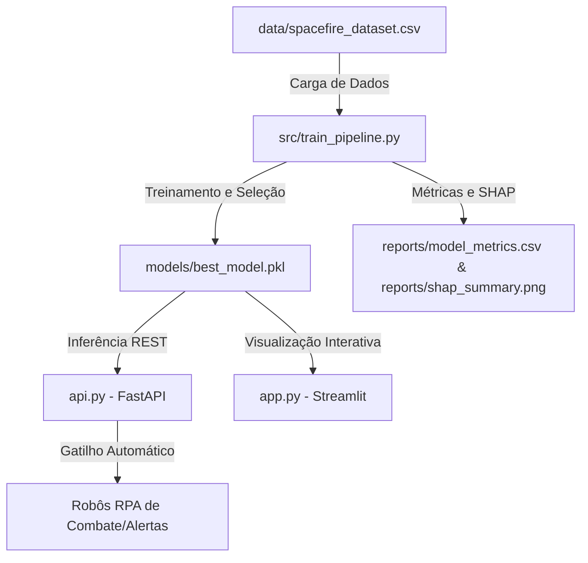

# SpaceFire Monitor

> **FIAP - 4º Ano de Engenharia de Software**  
> **Global Solution 2026** — *Tema: "Indústria Espacial: O Código que Move o Universo"*  
> **Disciplina**: *Generative AI for Engineering*  
> 
> **Integrantes:**  
> * Eric Rodrigues - RM 550249  
> * Victor Hugo Andrade - RM 550996  
> * Manoella Waideman - RM 98906  
> * Renato Ichikawa - RM 99242  
> * Bernardo Rocha - RM 99209  

---

## Contexto do Projeto

O **SpaceFire Monitor** é uma plataforma inteligente e integrada para o monitoramento, previsão e resposta automatizada a focos de incêndio florestal (queimadas) em todo o território nacional. 

No contexto da **Indústria Espacial**, o projeto conecta a coleta de dados de sensores orbitais terrestres com modelos preditivos de inteligência artificial de última geração e sistemas de automação de processos (**RPA**). A plataforma simula a fusão de dados de fontes públicas reais:
* **NASA FIRMS** (Active Fire Data - satélites MODIS e VIIRS)
* **INPE Queimadas** (Monitoramento de Biomas)
* **Open-Meteo** (Reanálise Climatológica e previsão atmosférica)

Esta parte do projeto representa o pipeline completo de Inteligência Artificial e Machine Learning aplicado ao risco de incêndio florestal, estruturando um processo ponta-a-ponta que vai desde o pré-processamento de dados até a explicabilidade científica (SHAP) e a implantação de serviços integráveis.

---

## Arquitetura da Solução

O ecossistema é composto por quatro grandes pilares modulares que garantem facilidade de manutenção e alta acoplabilidade comercial:



* **`data/spacefire_dataset.csv`**: Base de dados com mais de 1.000 amostras simulando as anomalias térmicas e condições climáticas.
* **`src/train_pipeline.py`**: Motor de treinamento responsável pelo pré-processamento, engenharia de recursos, ajuste de hiperparâmetros, benchmarking de múltiplos algoritmos de classificação e exportação de artefatos.
* **`api.py`**: API RESTful desenvolvida com **FastAPI** voltada para a integração com RPA (Robotic Process Automation), viabilizando respostas automáticas imediatas.
* **`app.py`**: Dashboard e demonstrador interativo desenvolvido em **Streamlit** para tomadores de decisão e engenheiros ambientais.

---

## O Dataset

O dataset sintético contém **1.200 observações** e **15 colunas**, o que atende e supera os requisitos acadêmicos da disciplina (mínimo de 1.000 linhas e 10 colunas). A lógica de simulação replica as condições físicas reais de ignição florestal brasileira.

### Dicionário de Atributos

| Variável | Tipo | Descrição | Fonte Simulada |
| :--- | :--- | :--- | :--- |
| **`latitude`** | Numérico | Coordenada geográfica de latitude do foco. | NASA FIRMS |
| **`longitude`** | Numérico | Coordenada geográfica de longitude do foco. | NASA FIRMS |
| **`temperature_2m`** | Numérico | Temperatura do ar a 2 metros de altura em °C. | Open-Meteo |
| **`relative_humidity_2m`** | Numérico | Umidade relativa do ar em %. | Open-Meteo |
| **`precipitation`** | Numérico | Precipitação pluviométrica acumulada em mm. | Open-Meteo |
| **`wind_speed_10m`** | Numérico | Velocidade do vento medida a 10 metros de altura (km/h). | Open-Meteo |
| **`soil_moisture_index`** | Numérico | Índice que mede a umidade superficial do solo (0.0 a 1.0). | Copernicus |
| **`ndvi`** | Numérico | Índice de vegetação por diferença normalizada (0.0 a 1.0). | Satélites Sentinel/Landsat |
| **`days_without_rain`** | Numérico | Dias consecutivos sem registro de chuva. | INPE Clima |
| **`brightness`** | Numérico | Temperatura de brilho do pixel de fogo ativo em Kelvin. | NASA FIRMS (MODIS/VIIRS) |
| **`frp`** | Numérico | Poder Radiativo do Fogo (FRP) em Megawatts (MW). | NASA FIRMS |
| **`confidence`** | Numérico | Grau de confiança de que a anomalia térmica é fogo real (0-100%).| NASA FIRMS |
| **`month`** | Numérico | Mês calendário da coleta (1 a 12). | Sistema |
| **`biome`** | Categórico | Bioma brasileiro onde o foco está localizado. | INPE Biomas |
| **`drought_index` (Derivada)** | Numérico | Índice de seca calculado: $\text{temp\_2m} \times \frac{100 - \text{humidity}}{100}$ | Engenharia de Recursos |
| **`vegetation_dryness` (Derivada)** | Numérico | Secura da vegetação acumulada: $\text{days\_without\_rain} \times (1.0 - \text{ndvi})$ | Engenharia de Recursos |
| **`fire_risk` (Alvo)** | Binário | Variável Target: `0` (Risco Baixo/Ignorável) ou `1` (Risco Alto). | Calculada / Target |

> [!NOTE]
> As variáveis **`drought_index`** e **`vegetation_dryness`** são criadas automaticamente na etapa de **Engenharia de Atributos (Feature Engineering)**. Elas combinam fatores meteorológicos e espaciais para enriquecer a capacidade preditiva do modelo de forma física e sem exigir dados adicionais do usuário final na API ou no App.

---

## Pipeline de IA e Modelagem

O pipeline em `src/train_pipeline.py` executa as seguintes etapas:

1. **Limpeza de Dados e Engenharia de Atributos**:
   * **Limpeza de Dados**: Remoção automatizada de duplicatas (`drop_duplicates()`) e verificação de integridade estrutural diretamente via Pandas.
   * **Engenharia de Atributos (Feature Engineering)**: Geração de features de domínio (`drought_index` e `vegetation_dryness`) para potencializar o aprendizado estatístico não linear dos modelos.
2. **Pré-processamento Automatizado**:
   * Criação de Pipelines do Scikit-Learn segregados para variáveis numéricas e categóricas.
   * **Imputação**: Mediana para numéricos, mais frequente para categóricos (lidando com nulos).
   * **Escalonamento**: `StandardScaler` para padronizar variáveis numéricas.
   * **Codificação**: `OneHotEncoder` com tratamento de novas categorias ocultas para os biomas.
2. **Treinamento Multimodelo**:
   * Treina e avalia simultaneamente: **Regressão Logística**, **Random Forest Classifier** e **Gradient Boosting Classifier**.
   * Utiliza particionamento estratificado (`StratifiedKFold`) para lidar com possíveis desbalanceamentos da variável alvo.
3. **Benchmarking e Seleção**:
   * As métricas (Acurácia, Precisão, Sensibilidade, F1-Score e ROC AUC) são tabuladas e comparadas.
   * O algoritmo com o melhor **F1-Score** é exportado em formato binário (`models/best_model.pkl`).
   * A tabela de performance é exportada em `reports/model_metrics.csv` para auditoria do dashboard.

---

## Explicabilidade Científica (SHAP)

Para contornar o problema do modelo como uma "caixa preta", utilizamos o **SHAP (SHapley Additive exPlanations)**, fundamentado em Teoria dos Jogos Cooperativos. O framework quantifica exatamente a força de influência de cada variável na predição final de risco.

O gráfico gerado automaticamente em `reports/shap_summary.png` expõe:
* **Importância Global**: Quais sensores ou fatores climáticos pesam mais na tomada de decisão do modelo.
* **Sentido do Impacto**: Se valores altos ou baixos (representados por cores vermelhas e azuis) estão acelerando ou reduzindo a probabilidade de incêndio ativo.

---

## Integração RPA (FastAPI REST API)

O arquivo `api.py` expõe um servidor REST robusto e leve, ideal para automações que monitoram anomalias termais em tempo real e disparam alertas via robôs (RPA).

### Regra de Classificação de Risco (Gatilho RPA)

O risco é classificado a partir da probabilidade contínua gerada pelo modelo de Machine Learning (`predict_proba`):
* **`baixo`**: Probabilidade abaixo de 40% (Sem alerta).
* **`medio`**: Probabilidade de 40% a 64% (Monitoramento recomendado).
* **`alto`**: Probabilidade de 65% a 84% (Alerta RPA Obrigatório).
* **`critico`**: Probabilidade de 85% ou superior (Alerta RPA de Urgência).

### Requisição de Exemplo (`POST /predict`)

*URL*: `http://localhost:8000/predict`  
*Headers*: `Content-Type: application/json`

**Body JSON**:
```json
{
  "latitude": -15.7801,
  "longitude": -47.9292,
  "temperature_2m": 33.5,
  "relative_humidity_2m": 32.0,
  "precipitation": 0.0,
  "wind_speed_10m": 18.5,
  "soil_moisture_index": 0.22,
  "ndvi": 0.42,
  "days_without_rain": 25,
  "brightness": 332.5,
  "frp": 45.0,
  "confidence": 85.0,
  "month": 8,
  "biome": "Cerrado"
}
```

### Resposta JSON Formatada

```json
{
  "risk_class": "alto",
  "risk_score": 0.782,
  "risk_probability": "78.20%",
  "alert_required": true,
  "model_version": "1.0.0"
}
```

---

## Instruções de Execução

### Pré-requisitos
Certifique-se de possuir o Python 3.9+ instalado em seu sistema operacional Windows.

### 1. Preparação do Ambiente Virtual
No terminal PowerShell ou Prompt de Comando, acesse a pasta raiz do projeto e ative a `venv` existente:
```powershell
# Ativação no Windows (PowerShell)
.\venv\Scripts\Activate.ps1
```

### 2. Instalação de Dependências
Certifique-se de que todas as bibliotecas necessárias, incluindo as bibliotecas da API (FastAPI, Uvicorn, Pydantic) e SHAP, estejam instaladas:
```bash
pip install -r requirements.txt
```

### 3. Treinamento do Pipeline e Exportação do Modelo
Execute o pipeline para verificar a integridade do dataset, comparar as métricas dos modelos, gerar o melhor classificador e criar o plot SHAP:
```bash
python src/train_pipeline.py
```

### 4. Executando a API REST (FastAPI)
Suba o servidor local da API para conexões de robôs de automação:
```bash
python api.py
# OU de forma direta via uvicorn:
# uvicorn api:app --host 0.0.0.0 --port 8000 --reload
```
Você poderá abrir a documentação interativaSwagger UI em seu navegador: [http://localhost:8000/docs](http://localhost:8000/docs)

### 5. Executando o Dashboard Interativo (Streamlit)
Abra o painel web interativo para visualizar a simulação preditiva, comparar os modelos e analisar o SHAP:
```bash
streamlit run app.py
```
O painel abrirá automaticamente no endereço [http://localhost:8501](http://localhost:8501).

### Deploy em Produção (Streamlit Community Cloud)

O dashboard interativo do projeto pode ser publicado online gratuitamente:
1. Envie o código completo do projeto para um repositório público em sua conta do **GitHub**.
2. Acesse o site oficial do [Streamlit Share](https://share.streamlit.io) e crie uma conta gratuita associada ao seu GitHub.
3. Clique no botão **"Create app"**, escolha o repositório correto, branch `main` e selecione `app.py` como arquivo principal.
4. Clique em **"Deploy!"**. Sua aplicação estará no ar em poucos segundos!
5. Copie a URL gerada e preencha abaixo para a entrega acadêmica.

**Link da Aplicação Funcionando**: [https://spacefire-monitor.streamlit.app](https://share.streamlit.io) *(Substitua pelo link gerado pelo Streamlit Cloud após seu deploy)*

---

## Equipe Acadêmica e Entrega
Este projeto foi refinado para atender com excelência aos critérios de entrega de Inteligência Artificial para Engenharia do 4º ano da FIAP.
